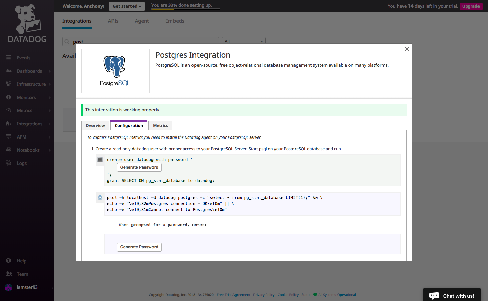
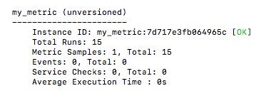
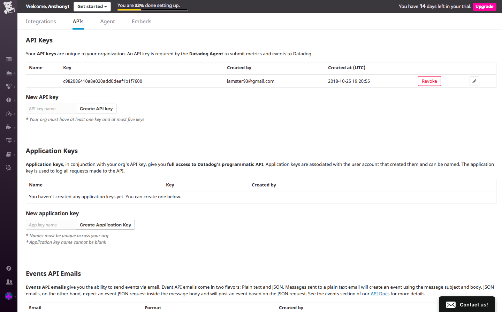
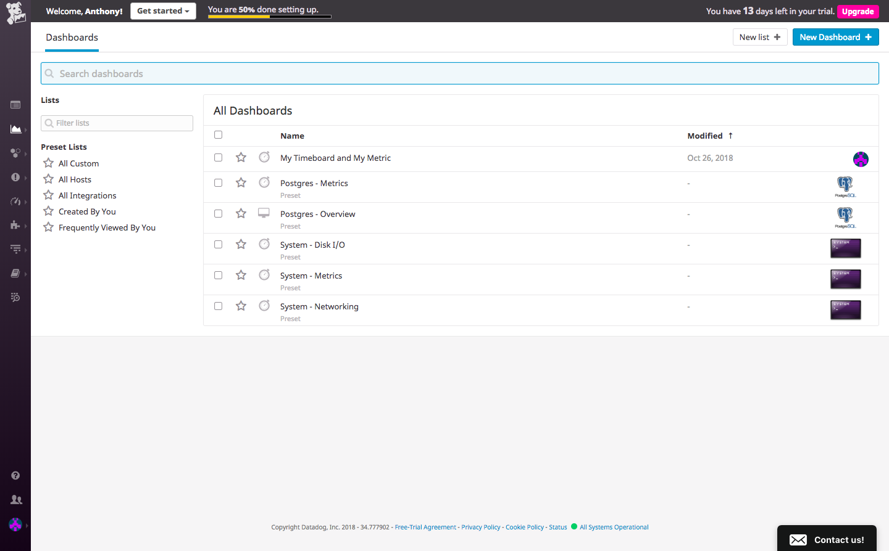
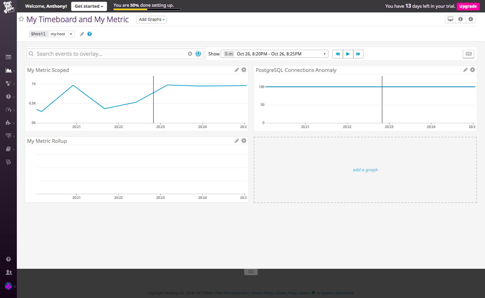
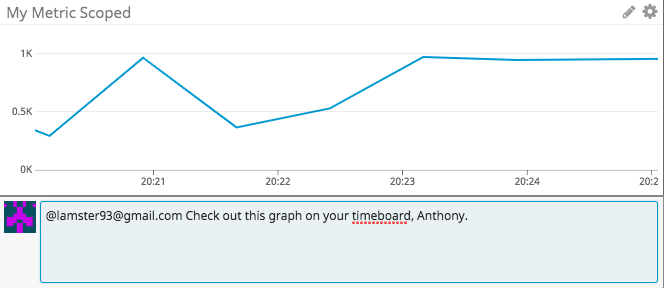

# Anthony Lam -- Solutions Engineer Answers

# Prerequisites - Setup the environment

The operating system used to complete this exercise was MacOS High Sierra Version 10.13.4.
A Linux Ubuntu VM was created using Vagrant and VirtualBox.

Download links:
1. 
2. 

After installing these two programs, run the following commands:
Create a Ubuntu 16.04 VM:
1. `vagrant init ubuntu/xenial64`

Start the VM:
2. `vagrant up`

Use the VM:
3. `vagrant ssh`

After these steps, sign up for a Datadog account 

The Datadog Agent is software that runs on your hosts and collects their events & metrics for you to utilize. More info can be found .

Navigate to the Agent Tab under the Integrations Tab and install the Datadog Agent for Ubuntu.

Install the Datadog Agent in the terminal by running the command in the one-step install. This may take some time.

`DD_API_KEY={YOUR_API_KEY} bash -c "$(curl -L https://raw.githubusercontent.com/DataDog/datadog-agent/master/cmd/agent/install_script.sh)"`

Installation Complete!  

The browser looks like this now. Click Finish to proceed.

# Collecting Metrics

## Add tags in the Agent config file and show us a screenshot of your host and its tags on the Host Map page in Datadog.*

Tags are assigned to hosts and integrations and are very important when it comes to presenting data on dashboards. Tags can represent sizes, roles, and locations. This will be useful for more granular metrics on our dashboards. More info can be found .

1. Using the terminal, navigate to the main directory(`:/`) of the VM.
2. Navigate to `/etc/datadog-agent/datadog.yaml`. This is where a host's tags can be configured.
3. Open the file using an editor. Vim and nano are built in if you do not wish to install one. It can be opened using `sudo nano datadog.yaml`.

Here are the tags I created. Remember to remove the `#`.  

After saving the configurations and restarting the Datadog Agent using `sudo service datadog-agent restart`, I navigated to Host Map tab under Infrastructure in the Datadog Application in my browser.

The host and tags should be visible and look similar to the image below:

## Install a database on your machine (MongoDB, MySQL, or PostgreSQL) and then install the respective Datadog integration for that database.

Let's install a database integration to test out.

I chose PostgreSQL for my database and downloaded it using the following commands:
1. `sudo apt-get update`
2. `sudo apt-get install postgresql postgresql-contrib`

More in-depth use past the installation step can be found .

I navigated to the Integrations Tab, found the PostgreSQL integration, and followed the configuration steps displayed.

1. Creating a user can only be done if you're in the postgres database. To do this, run the command: `sudo -u postgres psql`
2. Use the command: `createuser --interactive  -P` to create a datadog user with the password generated in the installation overview. Exit out using `\q`.
3. Navigate to `/etc/datadog-agent/conf.d/postgres.d`. Open the `conf.yaml.example` file using an editor. Edit the information, add tags, and save as `conf.yaml`!

Here's my conf.d/postgres.yaml file.

I ran a status check by running `sudo datadog-agent status` and the PostgreSQL integration check was successful.

After configuration, I proceeded to install the integration onto the Datadog platform

  

Writing an Agent check requires the creation of two files:
1. A Check file
2. A YAML configuration file

Using the terminal and the `touch` command, I created and editted a [my_metric.py](./files/my_metric.py) and [my_metric.yaml](./files/my_metric.yaml) file using `nano` and placed them in the checks.d and conf.d folders respectively.

I restarted the Datadog Agent using using `sudo service datadog-agent restart`. my_metric check is successfully being submitted after checking with `sudo datadog-agent status`.

## Change your check's collection interval so that it only submits the metric once every 45 seconds.

The minimal collection interval can be defined in the my_metric.yaml file at the instance level because of Agent 6.

Using a stopwatch, I started the timer when the total run count incremented by 1 and checked the Agent status constantly until the count incremented again. The metric was indeed submitting every 45 seconds.

## Bonus Question Can you change the collection interval without modifying the Python check file you created?

As shown in the previous step, the collection interval was changed in the my_metric.yaml file which didn't touch the Python check file (my_metric.py).

# Visualizing Data

## Utilize the Datadog API to create a Timeboard that contains:
1. Your custom metric scoped over your host.
2. Any metric from the Integration on your Database with the anomaly function applied.
3. Your custom metric with the rollup function applied to sum up all the points for the past hour into one bucket

In order to create a Timeboard while utilizing the Datadog API with Python, the Datadog package for Python has to be installed using Python's package management system called pip.

Pip can be installed using the command:

`sudo apt-get install python-pip`

With pip installed, the datadog package can be installed as well.

`pip install datadog`

These steps may take a while.

Generate an application key to use before creating the timeboard:

Utilizing Datadog's  on Timeboards, Datadog Docs for  and , and  the timeboard script was created and written using Python. It can be found :

The document was executed using python in the terminal. It was successfully created as shown in the Dashboard List.

When the timeboard is clicked, the platform displays the 3 graphs that are needed.

## Once this is created, access the Dashboard from your Dashboard List in the UI:

## Set the Timeboard's timeframe to the past 5 minutes

Although 5 minutes isn't a dropdown option for the Show section, it can be manually selected by selecting a start point on the graph, holding the click, and dragging it until there's approximately 5 minutes worth of selected data. The end result is displayed:

## Take a snapshot of this graph and use the @ notation to send it to yourself.

When I hover my cursor on a graph, I can click on the camera icon to snapshot the graph and send it to my email.

## Bonus Question: What is the Anomaly graph displaying?

The Amonaly graph is displaying the maximum number of client connections allowed to the PostgreSQL database while indicating whether there is any abnormal behavior. Red points indicate abnormal behavior and values outside the expected range of values. The range of values is represented by a grey background behind the data points. In my graph, there aren't any red points, only blue ones so there aren't any anomalies present.
