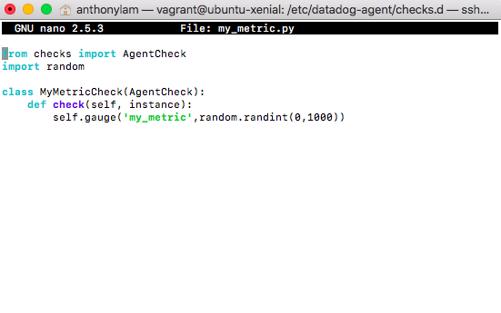
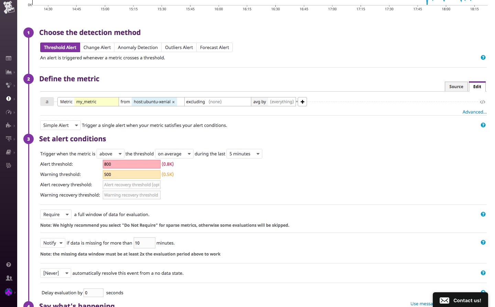
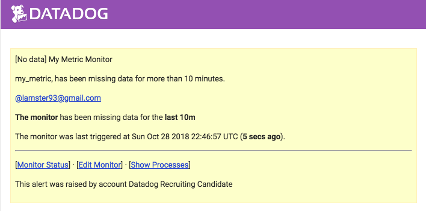
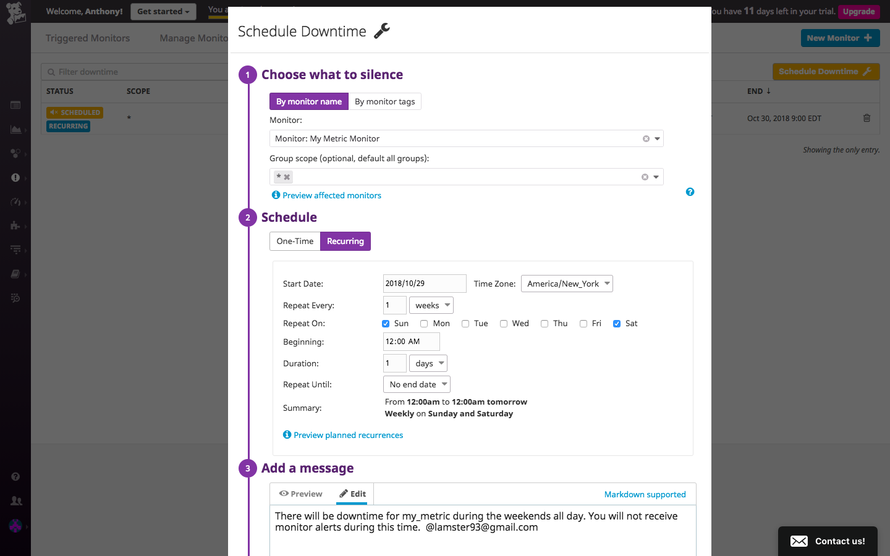
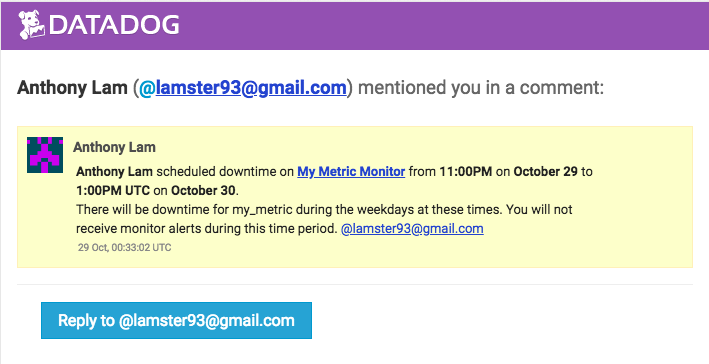
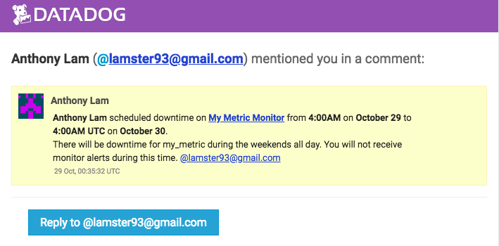
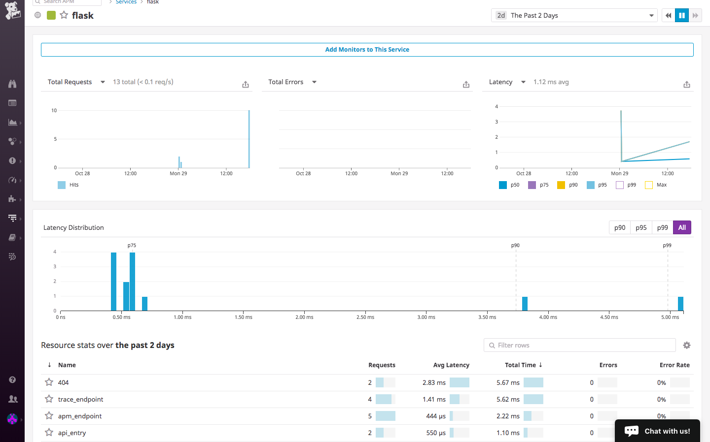

# Anthony Lam -- Solutions Engineer Answers

# Prerequisites - Setup the environment

The operating system used to complete this exercise was MacOS High Sierra Version 10.13.4.

After signing up for an account, I navigated to the Integrations Tab --> Agent Tab --> Mac OS X Tab.

I ran the one-line installation given to install the Datadog Agent in my terminal.

Installation Complete!  

# Collecting Metrics

## Add tags in the Agent config file and show us a screenshot of your host and its tags on the Host Map page in Datadog.*

Using the Datadog Agent GUI, I configured the hostname and tags in the Settings Tab.

After saving the configurations and restarting the Datadog Agent GUI, I navigated to Infrastructure  --> Host Map in the Datadog Application in my browser.

## Install a database on your machine (MongoDB, MySQL, or PostgreSQL) and then install the respective Datadog integration for that database.

I chose PostgreSQL for my database and downloaded it from their site. I navigated to the Integrations Tab, found the PostgreSQL integration, and followed the configuration steps displayed.

I edited the conf.d/postgres.yaml file.

I added the postgreSQL check to my Checks --> Manage Checks Tab in the GUI for future configurations.

I ran a status check and the PostgreSQL integration check was successful.

After configuration, I proceeded to install the integration onto the Datadog platform

  

## Create a custom Agent check that submits a metric named my_metric with a random value between 0 and 1000.

Writing an Agent check requires the creation of two files:
1. A Check file
2. A YAML configuration file

I created a [my_metric.py](./files/my_metric.py) and [my_metric.yaml](./files/my_metric.yaml) file and placed them in the checks.d and conf.d folders respectively.

I restarted the Datadog Agent GUI and my_metric check is successfully being submitted.

## Change your check's collection interval so that it only submits the metric once every 45 seconds.

The minimal collection interval can be defined in the my_metric.yaml file at the instance level because of Agent 6.

Using a stopwatch, I started the timer when the total run count incremented by 1 and refreshed the GUI constantly until the count incremented again. The metric was indeed submitting every 45 seconds.

## Bonus Question Can you change the collection interval without modifying the Python check file you created?

As shown in the previous step, the collection interval was changed in the my_metric.yaml file which didn't touch the Python check file (my_metric.py).

# Visualizing Data

## Utilize the Datadog API to create a Timeboard that contains:
1. Your custom metric scoped over your host.
2. Any metric from the Integration on your Database with the anomaly function applied.
3. Your custom metric with the rollup function applied to sum up all the points for the past hour into one bucket

In order to create a Timeboard while utilizing the Datadog API with Python, the Datadog package for Python has to be installed using Python's package management system called pip.

Pip can be installed using the command:

`sudo easy_install pip`

With pip installed, the datadog package can be installed as well.

`pip install datadog`

Utilizing Datadog's API documentation, Datadog Docs for anomalies and graphing, the timeboard script was created and written using Python. It can be found here: <link to timeboard/>

The document was executed using python in the terminal. It was successfully created as shown in the Dashboard List.

When the timeboard is clicked, the platform displays the 3 graphs that are needed.

## Once this is created, access the Dashboard from your Dashboard List in the UI:

## Set the Timeboard's timeframe to the past 5 minutes

Although 5 minutes isn't a dropdown option for the Show section, it can be manually selected by selecting a start point on the graph, holding the click, and dragging it until there's approximately 5 minutes worth of selected data. The end result is displayed:

## Take a snapshot of this graph and use the @ notation to send it to yourself.

Using the camera icon, I'm able to snapshot the graph and send it to my email.

## Bonus Question: What is the Anomaly graph displaying?

The Amonaly graph is displaying the number of transactions that have been committed in the PostgreSQL database while indicating whether there is any abnormal behavior. Red points indicate abnormal behavior and values outside the expected range of values. The range of values is represented by the grey background behind the data points. In my graph, any points below 0.018 transactions/second or higher than 0.020 transactions/second are anomalies.

# Monitoring Data

## Create a new Metric Monitor that watches the average of your custom metric (my_metric) and will alert if it’s above the following values over the past 5 minutes:

1. Warning threshold of 500
2. Alerting threshold of 800
3. And also ensure that it will notify you if there is No Data for this query over the past 10m.

A monitor can be created through two ways:
1. Navigating to the Monitors --> New Monitor --> Metric Tab on the left.
2. Hover over the graph you want to monitor, click the settings (cog icon) and click create new monitor

Once completed, I filled out the necessary information to meet the desired requirements

## Please configure the monitor’s message so that it will:

1. Send you an email whenever the monitor triggers.
2. Create different messages based on whether the monitor is in an Alert, Warning, or No Data state.
3. Include the metric value that caused the monitor to trigger and host ip when the Monitor triggers an Alert state.

## When this monitor sends you an email notification, take a screenshot of the email that it sends you.

Warn Email

Alert Email

No Data Email

## Bonus Question: Since this monitor is going to alert pretty often, you don’t want to be alerted when you are out of the office. Set up two scheduled downtimes for this monitor:

1. One that silences it from 7pm to 9am daily on M-F,
2. And one that silences it all day on Sat-Sun.

Monitors can be scheduled to have downtime by navigating to Monitors --> Manage Downtime.

This was done twice, one for weekdays and one for weekends. The images below illustrate the conditions used in the forms.

## Make sure that your email is notified when you schedule the downtime and take a screenshot of that notification.

# Collecting APM Data:

For this section, I used the Flask app provided.
Because I was on Mac OS X, I had to install the APM agent (Trace Agent) and manually run it.

Using the datadog-trace-agent repository and its README.md, I followed the instructions:

1. I downloaded the latest OSX Trace Agent release.

2. In order to run the Trace Agent using the Datadog Agent configuration, the trace agent has to have permission to execute it. The command below was executed in the terminal.

`chmod 755 trace-agent-darwin-amd64-6.5.0`  

3. Now the Trace Agent can be started and run in the background.

`./trace-agent-darwin-amd64-X.Y.Z -config /opt/datadog-agent/etc/datadog.yaml`

4. Enable trace collection for the Trace Agent and configure the environment. Setting my environment to none causes it to inherit from "env" tag which is production.

5. Instrumenting the application involves a few steps:
    1. Store the given Flask app inside a file --> I called it [app.py](./files/app.py)
    2. `pip install flask`
    3. `pip install ddtrace`
    4. run `ddtrace-run python app.py` in the terminal

6. I made several calls to the API to test the performance of the flask application by going through each of the routes on http://localhost:5050/.

## Provide a link and a screenshot of a Dashboard with both APM and Infrastructure Metrics.

https://p.datadoghq.com/sb/f25fcfec0-6d54b4bd3a28890f4b85b2f5379a1a1e

## Please include your fully instrumented app in your submission, as well.
[Flask App](./files/app.py)

## Bonus Question: What is the difference between a Service and a Resource?

A Service is comprised of a set of processes that work together to provide a feature set or perform a certain task. A web application is a good example that can be broken down into many services such as webapp services, admin services, database services, and query services. These services provide resources to help the user obtain information.

A Resource is a request or query to a service. An example would be a SQL query or a request to access a specific route or piece of data/information of an application.

# Final Question:

## Datadog has been used in a lot of creative ways in the past. We’ve written some blog posts about using Datadog to monitor the NYC Subway System, Pokemon Go, and even office restroom availability! Is there anything creative you would use Datadog for?

Anyone who has lived in NYC has experienced a rodent problem. Over the last decade, these furry creatures have become smarter and harder to get rid of. Although it'll take extensive work and preparation with sensors and detectors, Datadog can be used to analyze their behavior when you're not home or you're sleeping. You might find that they like to be in a certain area at a specific time or even discover entry points you weren't aware of. After an initial sampling of the situation, solutions or protocols can be implemented for a set period of time to analyze how effective they work and how the behavior of the rodents change.
